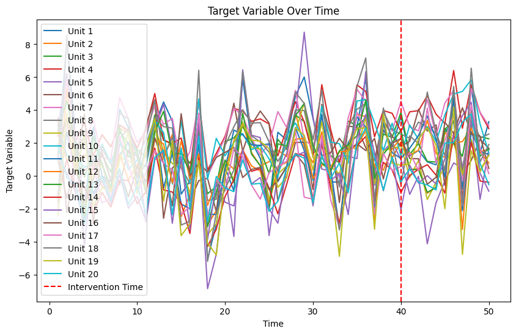
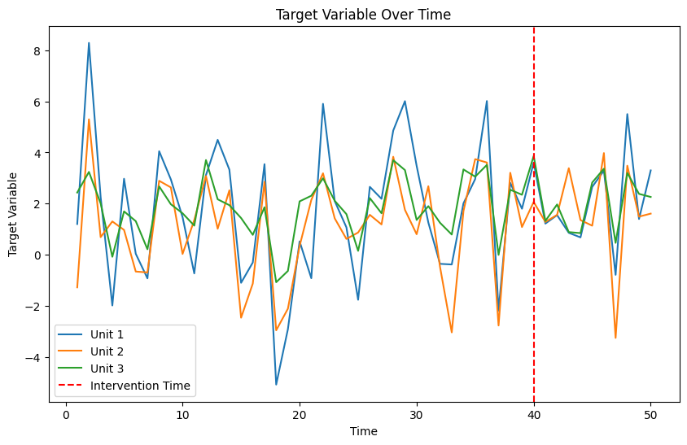
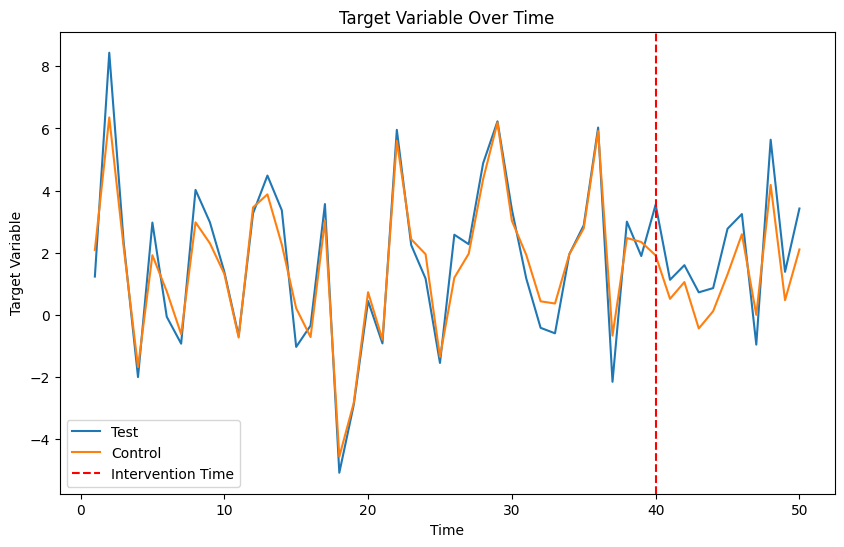

# synthx
SynthX: A Python Library for Advanced Synthetic Control Analysis

[](https://github.com/kenki931128/synthx/actions/workflows/python-code-lint.yaml) [](https://github.com/kenki931128/synthx/actions/workflows/python-code-test.yaml) [](https://pypi.org/project/synthx/)


## Algorithm Behind

### Synthetic Control
Synthetic Control is a statistical method for estimating the causal effect of an intervention on a single treated unit by constructing a weighted combination of control units that closely resembles the treated unit in terms of pre-intervention characteristics. This method is particularly useful when randomized experiments are not feasible, and there is a limited number of control units.

The key idea behind Synthetic Control is to create a "synthetic" control unit that serves as a counterfactual for the treated unit. By comparing the post-intervention outcomes of the treated unit with the outcomes of the synthetic control unit, one can estimate the causal effect of the intervention.

### Placebo Test
Placebo Test is a method for assessing the statistical significance of the estimated treatment effect in Synthetic Control. The idea is to apply the Synthetic Control method to control units that did not receive the intervention, pretending that they were treated at the same time as the actual treated unit. By comparing the estimated effect for the true treated unit with the distribution of placebo effects, one can determine whether the observed effect is likely due to chance or represents a genuine causal effect.

If the estimated effect for the true treated unit is larger than most of the placebo effects, it suggests that the intervention had a significant impact. On the other hand, if the true effect is similar in magnitude to the placebo effects, it indicates that the observed effect may be due to chance rather than the intervention.

### For more infomation

Read the paper: [Synthetic Control Methods for Comparative Case Studies: Estimating the Effect of California's Tobacco Control Program](https://dspace.mit.edu/handle/1721.1/59447)

## Set up

Install the latest SynthX version with

```
pip install synthx
```

## Usage

### Sample data generation

You can use your own data. For test purpose, you can generate sample data with

```python
import synthx as sx

df = sx.sample(
    n_units=20,
    n_time=50,
    n_observed_covariates=3,
    n_unobserved_covariates=1,
    intervention_units=1,
    intervention_time=40,
    intervention_effect=1.2,
    noise_effect=0.1,
    seed=42,
)
```

The `sample()` function generates a synthetic dataset with the specified number of units, time periods, observed and unobserved covariates, intervention units, intervention time, intervention effect, and noise effect. The `seed` parameter ensures reproducibility of the generated data.

```python
>>> df.head()
┌──────┬──────┬─────────┬────────────┬────────────┬────────────┐
│ unit ┆ time ┆ y       ┆ covariate_1┆ covariate_2┆ covariate_3┆
│ ---  ┆ ---  ┆ ---     ┆ ---        ┆ ---        ┆ ---        │
│ i64  ┆ i64  ┆ f64     ┆ f64        ┆ f64        ┆ f64        │
╞══════╪══════╪═════════╪════════════╪════════════╪════════════╡
│ 1    ┆ 1    ┆ 2.340096┆ 0.950088   ┆ 0.134298   ┆ 0.794324   │
├╌╌╌╌╌╌┼╌╌╌╌╌╌┼╌╌╌╌╌╌╌╌╌┼╌╌╌╌╌╌╌╌╌╌╌╌┼╌╌╌╌╌╌╌╌╌╌╌╌┼╌╌╌╌╌╌╌╌╌╌╌╌┤
│ 1    ┆ 2    ┆ 2.370135┆ 0.950088   ┆ 0.134298   ┆ 0.794324   │
├╌╌╌╌╌╌┼╌╌╌╌╌╌┼╌╌╌╌╌╌╌╌╌┼╌╌╌╌╌╌╌╌╌╌╌╌┼╌╌╌╌╌╌╌╌╌╌╌╌┼╌╌╌╌╌╌╌╌╌╌╌╌┤
│ 1    ┆ 3    ┆ 2.776434┆ 0.950088   ┆ 0.134298   ┆ 0.794324   │
├╌╌╌╌╌╌┼╌╌╌╌╌╌┼╌╌╌╌╌╌╌╌╌┼╌╌╌╌╌╌╌╌╌╌╌╌┼╌╌╌╌╌╌╌╌╌╌╌╌┼╌╌╌╌╌╌╌╌╌╌╌╌┤
│ 1    ┆ 4    ┆ 3.140631┆ 0.950088   ┆ 0.134298   ┆ 0.794324   │
├╌╌╌╌╌╌┼╌╌╌╌╌╌┼╌╌╌╌╌╌╌╌╌┼╌╌╌╌╌╌╌╌╌╌╌╌┼╌╌╌╌╌╌╌╌╌╌╌╌┼╌╌╌╌╌╌╌╌╌╌╌╌┤
│ 1    ┆ 5    ┆ 3.410797┆ 0.950088   ┆ 0.134298   ┆ 0.794324   │
└──────┴──────┴─────────┴────────────┴────────────┴────────────┘

```

### Dataset instance

Create a `Dataset` instance from the generated or your own data. The `Dataset` class is used to encapsulate the data and provide methods for data validation and visualization.

Note: all units should have the same timestamps.

```python
dataset = sx.Dataset(
    df,
    unit_column = 'unit',
    time_column = 'time',
    y_column = 'y',
    covariate_columns = ['covariate_1', 'covariate_2', 'covariate_3'],
    intervention_units=1,
    intervention_time=40,
)
```

You can plot the generated data using the `plot()` method of the `Dataset` instance.

```python
>>> dataset.plot()
```



If there are too many units, you can specify the units to visualize.

```python
>>> dataset.plot([1, 2, 3])
```


### Synthetic Control

Perform Synthetic Control analysis on the `Dataset` instance using the `synthetic_control()` function.

```python
sc = sx.synthetic_control(dataset)
```

You can plot the test and control units using the `plot()` method of the `SyntheticControlResult` instance returned by `synthetic_control()`.

```python
>>> sc.plot()
```



You can estimate the causal effect of the intervention using the `estimate_effects()` method.

```python
>>> sc.estimate_effects()
[0.8398940970771678]
```

### Placebo Test

Perform a Placebo Test to assess the statistical significance of the estimated treatment effect using the `placebo_test()` function.

```python
effects_test, effects_placebo, sc_test, scs_placebo = sx.placebo_test(dataset)
```

Calculate the p-value of the estimated treatment effect using the `calc_p_value()` function from the `stats` module.

```python
>>> sx.stats.calc_p_value(effects_test, effects_placebo)
0.03228841882463891
```

### Sensitivity Check

Perform a sensitivity check on the synthetic control results using the `placebo_sensitivity_check()` function.

```python
>>> effects_test, effects_placebo, sc_test, scs_placebo = sx.placebo_test(dataset)
>>> sx.placebo_sensitivity_check(dataset, effects_placebo)
1.05
```

This means this set up can capture the effect of the intervention which has more than 5 % uplift.

OR you can do with the `ttest_sensitivity_check()` function.

```python
>>> sx.ttest_sensitivity_check(dataset)
1.05
```

## Contributing

Please read [developer docs](./docs/developers/README.md) for information on how to contribute to the project.
